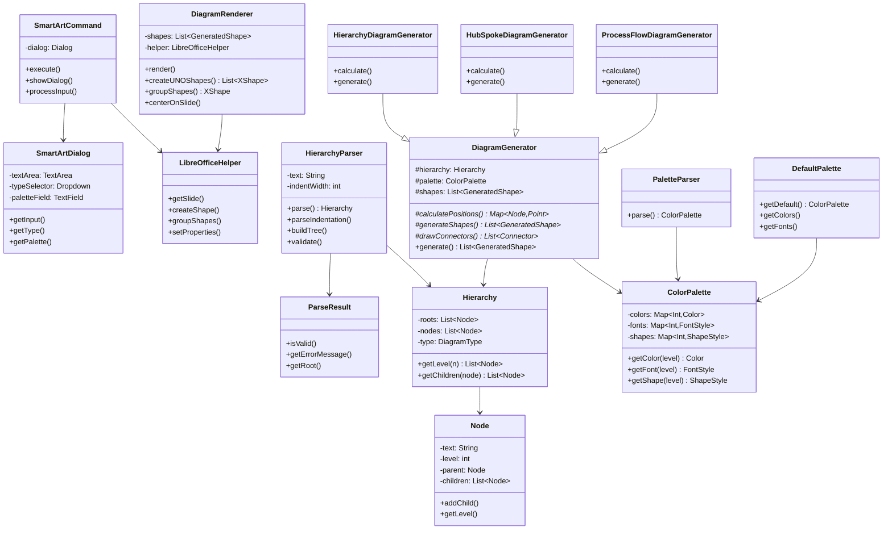

# LibreImpress SmartArt - Architecture & Development Documentation

---

## Part 1: UML Architecture Diagrams

### 1.1 Class Diagram - Core Components



### 1.2 Component Architecture Diagram

```mermaid
graph TB
    subgraph LibreImpress["LibreOffice Impress (Host)"]
        subgraph Extension["SmartArt UNO Extension"]
            subgraph UILayer["UI Layer"]
                Dialog["SmartArtDialogController<br/>- Dialog XML<br/>- Event Handlers"]
            end
            
            subgraph ProcessingLayer["Processing/Logic Layer"]
                InputVal["ParseResult<br/>(validation in HierarchyParser)"]
                Parser["HierarchyParser"]
                PaletteP["PaletteParser"]
                HierModel["Hierarchy Data Model<br/>- Node tree structure<br/>- Parent-child relationships"]
            end
            
            subgraph GeneratorLayer["Generator Layer"]
                GenAbs["DiagramGenerator<br/>Abstract"]
                HierGen["HierarchyDiagramGen"]
                HubGen["HubSpokeDiagramGen"]
                ProcGen["ProcessFlowDiagramGen"]
                PosBcalc["Position Calculator<br/>- Layout algorithms"]
                ShapeF["Shape Factory<br/>- Creates shape objects"]
            end
            
            subgraph RenderingLayer["Rendering Layer"]
                Renderer["DiagramRenderer<br/>- Converts to UNO shapes<br/>- Groups & positions on slide"]
                LibOHelper["LibreOfficeHelper<br/>- UNO API wrapper<br/>- Shape creation/positioning"]
            end
        end
        
        LibCore["LibreOffice Core APIs<br/>- XDrawPage Slide<br/>- XShape Graphics<br/>- XComponentContext"]
    end
    
    Dialog --> InputVal
    Dialog --> Parser
    InputVal --> PaletteP
    Parser --> HierModel
    PaletteP --> GenAbs
    HierModel --> GenAbs
    GenAbs --> HierGen
    GenAbs --> HubGen
    GenAbs --> ProcGen
    HierGen --> PosBcalc
    HubGen --> PosBcalc
    ProcGen --> PosBcalc
    PosBcalc --> ShapeF
    ShapeF --> Renderer
    Renderer --> LibOHelper
    LibOHelper --> LibCore
    
    style Extension fill:#e1f5ff
    style UILayer fill:#fff3e0
    style ProcessingLayer fill:#f3e5f5
    style GeneratorLayer fill:#e8f5e9
    style RenderingLayer fill:#fce4ec
```



---

## Part 2: V-Diagram (Vee-Model - Development & Testing Strategy)

```mermaid
graph LR
    %% LEFT SIDE - REQUIREMENTS & DESIGN (Top-left descending)
    REQ["📋 Requirements<br/>Specification"]
    ARCH["🏗️ Architecture<br/>Design"]
    P1["Phase 1<br/>Project Setup<br/>Maven + UNO SDK"]
    P2["Phase 2<br/>Dialog & UI<br/>Dialog XML"]
    P3["Phase 3<br/>Hierarchy Parser<br/>Node Model"]
    P4["Phase 4<br/>Palette System<br/>JSON Parser"]
    P5["Phase 5<br/>Generators<br/>3 Diagram Types"]
    P5A["Phase 5.1<br/>Rendering<br/>DiagramRenderer"]
    
    %% BOTTOM - CODE IMPLEMENTATION (Bottom center)
    CODE["💻 CODE & UNIT TEST<br/>SmartArtCommand<br/>Integration"]
    
    %% RIGHT SIDE - TESTING & VALIDATION (Bottom-right ascending)
    T5C["Phase 5.3<br/>Parser Tests<br/>Indentation"]
    T5B["Phase 5.4<br/>Palette Tests<br/>JSON Parse"]
    T5A["Phase 5.5<br/>Generator Tests<br/>Position Calc"]
    T6B["Phase 6.5<br/>Renderer Tests<br/>Shape Creation"]
    T6A["Phase 6.6<br/>LibOffice Helper<br/>UNO Tests"]
    INTTEST["Phase 7<br/>Integration Tests<br/>Component Flow"]
    SYSEST["Phase 8<br/>System Tests<br/>End-to-End"]
    UATTEST["Phase 9<br/>UAT & Manual<br/>LibreImpress"]
    
    %% Connections - LEFT SIDE descending
    REQ --> ARCH
    ARCH --> P1
    P1 --> P2
    P2 --> P3
    P3 --> P4
    P4 --> P5
    P5 --> P5A
    P5A --> CODE
    
    %% Connections - RIGHT SIDE ascending
    CODE --> T5C
    T5C --> T5B
    T5B --> T5A
    T5A --> T6B
    T6B --> T6A
    T6A --> INTTEST
    INTTEST --> SYSEST
    SYSEST --> UATTEST
    
    %% Styling - LEFT SIDE (Blue for requirements/design)
    style REQ fill:#bbdefb,stroke:#1976d2,stroke-width:3px,color:#000
    style ARCH fill:#bbdefb,stroke:#1976d2,stroke-width:3px,color:#000
    
    %% Styling - MIDDLE (Green for development)
    style P1 fill:#c8e6c9,stroke:#388e3c,stroke-width:2px,color:#000
    style P2 fill:#c8e6c9,stroke:#388e3c,stroke-width:2px,color:#000
    style P3 fill:#c8e6c9,stroke:#388e3c,stroke-width:2px,color:#000
    style P4 fill:#c8e6c9,stroke:#388e3c,stroke-width:2px,color:#000
    style P5 fill:#c8e6c9,stroke:#388e3c,stroke-width:2px,color:#000
    style P5A fill:#c8e6c9,stroke:#388e3c,stroke-width:2px,color:#000
    
    %% Styling - BOTTOM (Yellow for integration)
    style CODE fill:#fff9c4,stroke:#f57f17,stroke-width:3px,color:#000
    
    %% Styling - RIGHT SIDE (Orange/Red for testing)
    style T5C fill:#ffccbc,stroke:#d84315,stroke-width:2px,color:#000
    style T5B fill:#ffccbc,stroke:#d84315,stroke-width:2px,color:#000
    style T5A fill:#ffccbc,stroke:#d84315,stroke-width:2px,color:#000
    style T6B fill:#ffccbc,stroke:#d84315,stroke-width:2px,color:#000
    style T6A fill:#ffccbc,stroke:#d84315,stroke-width:2px,color:#000
    style INTTEST fill:#ffccbc,stroke:#d84315,stroke-width:2px,color:#000
    style SYSEST fill:#ffccbc,stroke:#d84315,stroke-width:2px,color:#000
    
    %% Styling - TOP (Purple for validation)
    style UATTEST fill:#e0bee7,stroke:#7b1fa2,stroke-width:3px,color:#000
```



### Vee-Model Explanation:

**Left Side (Development - Going Down):**
- **Requirements:** Project specification (impressSmartArt.md)
- **Architecture:** System design (this document, UML diagrams)
- **Phases 1-5.1:** Implementation phases (design to coding)

**Bottom (Integration Point):**
- **Code & Unit Test:** All components integrated, SmartArtCommand orchestrates flow

**Right Side (Testing - Going Up):**
- **Phases 5.3-6.5:** Unit tests for each component
- **Phase 7:** Integration tests combining components
- **Phase 8:** System tests end-to-end
- **Phase 9:** UAT and manual testing in LibreOffice

**Testing Hierarchy:**

```
UAT/Manual Testing (Phase 9) ← Top of V-diagram (most complete)
    ↑
System Testing (Phase 8) ← Full feature validation
    ↑
Integration Testing (Phase 7) ← Component combinations
    ↑
Unit Tests (Phases 5.3-6.5) ← Individual components
    ↑
Code & Integration (Bottom) ← SmartArtCommand point
    ↓
Architecture Design
    ↓
Requirements → Specification
```

**Key Principle:** Each phase on the LEFT has a corresponding test phase on the RIGHT that verifies what was built.

Mapping:
- P5.1 (Renderer) ↔ T6A (Renderer Tests)
- P5.1 + P6 (LibOffice Helper) ↔ T6B (LibOffice Tests)
- P5 (Generators) ↔ T5A (Generator Tests)
- P4 (Palette) ↔ T5B (Palette Tests)
- P3 (Parser) ↔ T5C (Parser Tests)
- All above ↔ Phase 7 (Integration)
- All above ↔ Phase 8 (System)
- All above ↔ Phase 9 (UAT/Manual)

---

## Part 3: Data Flow Diagram

```mermaid
graph LR
    A["👤 User Input<br/>- Diagram Type<br/>- Text with indent<br/>- Palette JSON"]
    B["📝 SmartArtDialog<br/>Dialog Controller"]
    C["✔️ Validation<br/>HierarchyParser → ParseResult"]
    D["🔀 HierarchyParser<br/>Parse indentation<br/>Build parent-child links"]
    E["🎨 PaletteParser<br/>Parse JSON palette<br/>Apply defaults"]
    F["📊 Hierarchy Object<br/>Node tree structure<br/>Ready for generation"]
    G["🎯 ColorPalette Object<br/>Colors, fonts, styles<br/>per level"]
    H["🏗️ DiagramGenerator<br/>SELECT type:<br/>- HierarchyGen<br/>- HubSpokeGen<br/>- ProcessFlowGen"]
    I["🖼️ GeneratedShape List<br/>Shapes + Positions<br/>+ Styling"]
    J["🎨 DiagramRenderer<br/>Convert to UNO shapes<br/>Apply styles & positions"]
    K["📐 LibreOfficeHelper<br/>UNO API calls<br/>Create/group shapes"]
    L["✨ LibreOffice Impress<br/>Diagram inserted<br/>User can edit"]
    
    A --> B
    B --> C
    C --> D
    C --> E
    D --> F
    E --> G
    F --> H
    G --> H
    H --> I
    I --> J
    J --> K
    K --> L
    
    style A fill:#e1f5fe
    style B fill:#f3e5f5
    style C fill:#fce4ec
    style D fill:#e8f5e9
    style E fill:#e8f5e9
    style F fill:#fff9c4
    style G fill:#fff9c4
    style H fill:#ffe0b2
    style I fill:#c8e6c9
    style J fill:#c8e6c9
    style K fill:#bbdefb
    style L fill:#f0f4c3
```



---

## Part 4: Testing Strategy Matrix

```
┌─────────────────────────────────────────────────────────────────────────────┐
│                    COMPREHENSIVE TESTING MATRIX                             │
└─────────────────────────────────────────────────────────────────────────────┘

PHASE │  COMPONENT          │ TEST TYPE     │ TEST CASES
──────┼─────────────────────┼───────────────┼───────────────────────────────
P5.3  │ HierarchyParser     │ Unit Tests    │
      │                     │               │ ✓ Valid 3-level hierarchy
      │                     │               │ ✓ 4+ level hierarchy
      │                     │               │ ✓ Single root multiple children
      │                     │               │ ✓ Tab indentation detection
      │                     │               │ ✓ Space indentation (4/2 spaces)
      │                     │               │ ✓ Mixed indentation handling
      │                     │               │ ✓ Invalid level jumps (1→3)
      │                     │               │ ✓ Empty lines handling
      │                     │               │ ✓ Whitespace trimming
      │                     │               │ ✓ Minimum 3 nodes validation
      │                     │               │ ✓ Parent-child relationship
──────┼─────────────────────┼───────────────┼───────────────────────────────
P5.4  │ PaletteParser       │ Unit Tests    │
      │                     │               │ ✓ Valid JSON palette
      │                     │               │ ✓ Missing palette (defaults)
      │                     │               │ ✓ Invalid JSON format
      │                     │               │ ✓ Partial palette (levels 1-2)
      │                     │               │ ✓ Color hex validation
      │                     │               │ ✓ Font name validation
      │                     │               │ ✓ Font size bounds
──────┼─────────────────────┼───────────────┼───────────────────────────────
P5.5  │ HierarchyGenerator  │ Unit Tests    │
      │                     │               │ ✓ Position calculation
      │                     │               │ ✓ Shape generation
      │                     │               │ ✓ Connector drawing
      │                     │               │ ✓ Centering logic
      │                     │               │ ✓ Spacing calculations
      │                     │               │
      │ HubSpokeGenerator   │               │ ✓ Radial positioning
      │                     │               │ ✓ Hub/spoke distinction
      │                     │               │ ✓ Angular calculations
      │                     │               │ ✓ Secondary level branching
      │                     │               │
      │ ProcessFlowGenerator│               │ ✓ Sequential positioning
      │                     │               │ ✓ Branch positioning
      │                     │               │ ✓ Arrow direction
──────┼─────────────────────┼───────────────┼───────────────────────────────
P6    │ LibreOfficeHelper   │ Unit Tests    │
      │                     │               │ ✓ Shape creation methods
      │                     │               │ ✓ Color/font application
      │                     │               │ ✓ Position/size setting
      │                     │               │ ✓ Connector creation
      │                     │               │ ✓ Grouping logic
      │                     │               │ ✓ UNO exception handling
──────┼─────────────────────┼───────────────┼───────────────────────────────
P6.5  │ DiagramRenderer     │ Unit Tests    │
      │                     │               │ ✓ Shape list → UNO conversion
      │                     │               │ ✓ Coordinate transformation
      │                     │               │ ✓ Grouping implementation
      │                     │               │ ✓ Slide insertion
      │                     │               │ ✓ Error rollback
──────┼─────────────────────┼───────────────┼───────────────────────────────
P7    │ Integration Flow    │ Integration   │
      │                     │ Tests         │ ✓ Parser + HierarchyGen
      │                     │               │ ✓ HubSpokeGen + Palette
      │                     │               │ ✓ ProcessFlowGen + Palette
      │                     │               │ ✓ Generator + Renderer
      │                     │               │ ✓ Full pipeline (all types)
      │                     │               │ ✓ Error handling integration
──────┼─────────────────────┼───────────────┼───────────────────────────────
P7    │ System (End-to-End) │ Integration   │
      │                     │ Tests         │ ✓ Dialog open → diagram render
      │                     │               │ ✓ Hierarchy diagram type
      │                     │               │ ✓ Hub & Spoke diagram type
      │                     │               │ ✓ Process Flow diagram type
      │                     │               │ ✓ Custom palette application
      │                     │               │ ✓ Default palette fallback
      │                     │               │ ✓ Invalid input handling
      │                     │               │ ✓ Error messages clarity
──────┼─────────────────────┼───────────────┼───────────────────────────────
P7    │ Manual User Tests   │ Manual        │
      │                     │ Testing       │ ✓ Plugin menu visible
      │                     │               │ ✓ Dialog launches correctly
      │                     │               │ ✓ Text input responsive
      │                     │               │ ✓ Diagram renders on slide
      │                     │               │ ✓ Colors applied correctly
      │                     │               │ ✓ Text readable at all levels
      │                     │               │ ✓ Shapes editable after create
      │                     │               │ ✓ Shapes properly grouped
      │                     │               │ ✓ Performance acceptable
      │                     │               │ ✓ No crashes/exceptions
```

---

## Summary: Architecture & Testing Strategy

### Architecture Highlights:
- **Layered Design**: UI → Processing → Generation → Rendering
- **Separation of Concerns**: Parser, Generator, Renderer each independent
- **Polymorphism**: DiagramGenerator abstract with 3 concrete implementations
- **Data-Driven**: Clean data models (Node, Hierarchy, Palette)
- **UNO Bridge**: Isolated helper class for LibreOffice integration

### Testing Strategy:
- **Bottom-up approach**: Unit tests first, then integration, then system
- **V-Diagram**: Left side (design/code), right side (validate), bottom (integration)
- **Coverage**: Parser, Palette, 3 Generators, Renderer, helpers
- **Validation**: Hierarchy structure, positioning logic, rendering, error cases
- **Manual verification**: LibreOffice Impress actual testing

### Quality Gates:
✅ All unit tests pass  
✅ All integration tests pass  
✅ System tests on real LibreOffice  
✅ No exceptions/crashes  
✅ Visual validation (diagrams look professional)  

