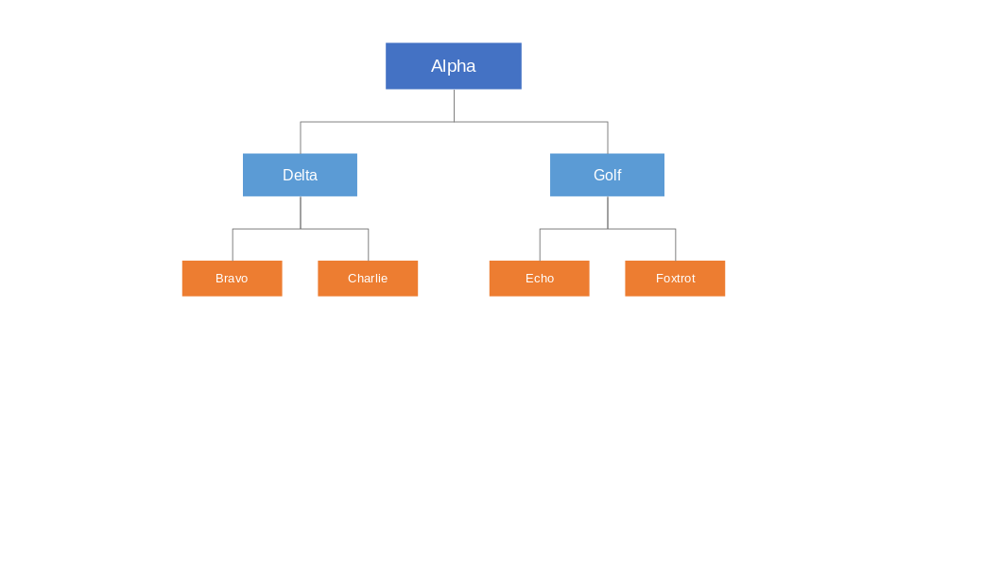
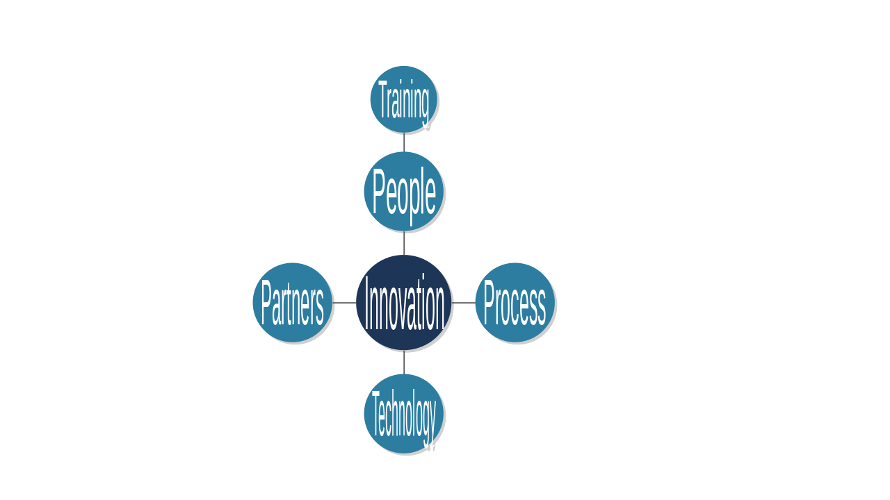
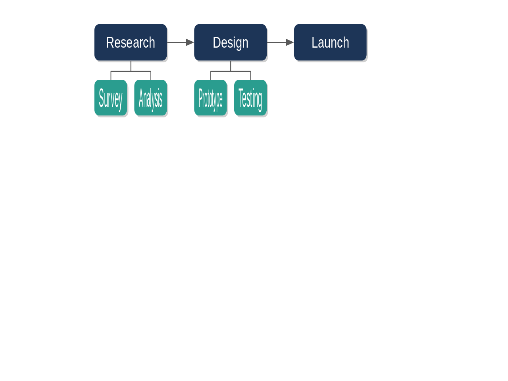
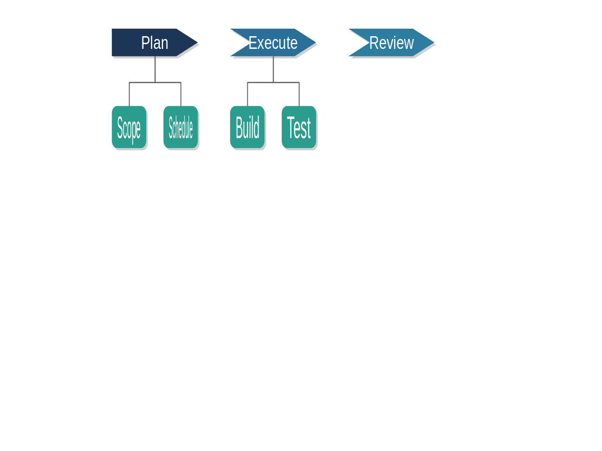

# LibreImpress SmartArt

A LibreOffice Impress UNO extension that generates structured diagrams
(hierarchy, hub-and-spoke, process flow, sequential chevron) from hierarchical
text input.

**Current status**
- ✅ **Phase 1 — Empty OXT extension:** a minimal, installable `.oxt` skeleton.
- ✅ **Phase 2 — Menu integration:** a top-level **SmartArt** menu whose
  *Create Diagram…* item dispatches to the Java handler (`SmartArtCommand`).
- ✅ **Phase 3 — Dialog & text parsing:** *Create Diagram…* opens an input
  dialog (text + diagram-type dropdown); on Create the indented text is parsed
  into a validated hierarchy and the parsed tree (or a clear error) is shown.
- ✅ **Phase 4 — Shape rendering:** the parsed tree is drawn as grouped,
  editable shapes on the slide. All four diagram types are fully rendered.
- ✅ **Phase 5 — Default colour palette:** shapes are automatically styled
  with a built-in blue/green palette based on shape kind and hierarchy level.
- ✅ **Phase 6 — Arrow heads & font scaling:** Process Flow step connectors
  carry directional arrowheads; text size scales with hierarchy level (14/11/9 pt).
- ✅ **Phase 7 — Process Flow sub-items:** level-2+ children of each step are
  stacked vertically below it, connected top-to-bottom.
- ✅ **Phase 8 — Hub & Spoke children:** level-3+ descendants of each spoke are
  placed radially outward along the same angle, connected with straight lines.

See [`impressSmartArt.md`](impressSmartArt.md) for the master specification and
the full document hierarchy.

## Diagram types

| Type | Description | Screenshot |
|------|-------------|------------|
| **Hierarchy** | Top-down tree: one box per node, parents centred over children, connected by lines |  |
| **Hub & Spoke** | Central circle hub with spoke circles radiating outward, connected by straight lines |  |
| **Process Flow** | Left-to-right sequence of rectangles joined by connectors, with sub-steps below each |  |
| **Sequential Chevron** | Horizontal arrow-chevron sequence (first step is a flat-back pentagon; subsequent steps are notched chevrons) with sub-items below |  |

## Prerequisites

- **JDK 11+** — `java -version`
- **Maven 3.6+** — `mvn --version`
- **LibreOffice 7.4+** — only needed to install/test the extension; provides the
  `unopkg` tool used below.

## Build

```bash
mvn clean package
```

Produces **`target/SmartArt.oxt`** (the installable extension) and
`target/smartart.jar` (the compiled component).

## Install & verify

The reliable way to confirm the extension registers is to install it with
`unopkg`. Use an **isolated user profile** so testing never disturbs your real
LibreOffice profile:

```bash
PROFILE=file:///tmp/lo-test

# install
unopkg add    --suppress-license -env:UserInstallation=$PROFILE target/SmartArt.oxt

# verify — expect "Identifier: org.libreimpress.smartart"
unopkg list   -env:UserInstallation=$PROFILE

# uninstall
unopkg remove -env:UserInstallation=$PROFILE org.libreimpress.smartart
```

To install into your **real** LibreOffice instead, drop the `-env:` argument
(close all LibreOffice windows and the quickstarter first):

```bash
unopkg add --suppress-license target/SmartArt.oxt
```

Then open Impress — a **SmartArt** menu appears in the menu bar with
*Create Diagram…*.

## Regenerate screenshots

```bash
bash scripts/make-screenshots.sh
```

This builds the `.oxt`, starts a throwaway headless LibreOffice, draws each
diagram type, and exports PNGs to `docs/screenshots/`. Pass `--oxt
target/SmartArt.oxt` to skip the build step.

## Project structure

```
LibreImpress-SmartArt/
├── pom.xml
├── src/
│   ├── main/
│   │   ├── java/org/libreimpress/smartart/
│   │   │   ├── SmartArtCommand.java        # UNO ProtocolHandler component + dispatch
│   │   │   ├── SmartArtDialog.java         # programmatic UNO input dialog (outline editor)
│   │   │   ├── models/                     # DiagramNode, DiagramType
│   │   │   ├── parsers/                     # HierarchyParser, ParseResult (pure Java)
│   │   │   ├── editing/                     # OutlineEditor — indent/outdent/newline transforms
│   │   │   ├── layout/                      # layout algorithms (pure Java, unit-tested)
│   │   │   │   ├── HierarchyLayout.java
│   │   │   │   ├── HubAndSpokeLayout.java
│   │   │   │   ├── ProcessFlowLayout.java
│   │   │   │   ├── SequentialChevronLayout.java
│   │   │   │   ├── DiagramLayout.java
│   │   │   │   ├── LaidOutShape.java
│   │   │   │   ├── Edge.java
│   │   │   │   └── ShapeKind.java
│   │   │   ├── rendering/                   # SlideRenderer — draws boxes + connectors
│   │   │   └── helpers/                     # LibreOfficeHelper (message boxes)
│   │   ├── assembly/
│   │   │   └── oxt.xml                      # assembles the .oxt
│   │   └── resources/
│   │       ├── META-INF/
│   │       │   ├── manifest.xml
│   │       │   └── MANIFEST.MF
│   │       ├── description.xml
│   │       ├── Addons.xcu
│   │       ├── ProtocolHandler.xcu
│   │       └── uno/
│   │           └── SmartArtImpl.xml
│   └── test/java/org/libreimpress/smartart/
│       ├── parsers/HierarchyParserTest.java
│       ├── editing/OutlineEditorTest.java
│       └── layout/                          # layout unit tests
├── uno-tests/                               # live headless-LibreOffice tests
│   ├── run.sh
│   └── probes/
│       ├── _connect.py
│       ├── registration_probe.py
│       ├── render_probe.py
│       └── screenshot_probe.py              # draws all diagram types → PNG
├── scripts/
│   └── make-screenshots.sh                  # regenerates docs/screenshots/
└── docs/
    └── screenshots/
        ├── hierarchy.png
        ├── hub-and-spoke.png
        ├── process-flow.png
        └── sequential-chevron.png
```

## Continuous integration

`.github/workflows/build-and-validate.yml` runs on every push: it builds the
`.oxt`, validates its structure, installs LibreOffice, and then performs
`unopkg add` / `list` / `remove` under `xvfb`. A registration regression
(wrong component namespace, bad identifier, missing file) fails CI rather than
only surfacing during a manual install.

## Documentation

| Document | Purpose |
|----------|---------|
| [`impressSmartArt.md`](impressSmartArt.md) | Master specification + packaging/registration rules |
| [`Phase1_ImplementationPlan.md`](Phase1_ImplementationPlan.md) | Phase 1 — empty OXT extension |
| [`Phase2_ImplementationPlan.md`](Phase2_ImplementationPlan.md) | Phase 2 — menu integration |
| [`Phase3_ImplementationPlan.md`](Phase3_ImplementationPlan.md) | Phase 3 — dialog & text parsing |
| [`Phase4_ImplementationPlan.md`](Phase4_ImplementationPlan.md) | Phase 4 — shape rendering |
| [`Phase5_ImplementationPlan.md`](Phase5_ImplementationPlan.md) | Phase 5 — default colour palette |
| [`Phase6_ImplementationPlan.md`](Phase6_ImplementationPlan.md) | Phase 6 — arrow heads & font size scaling |
| [`Phase7_ImplementationPlan.md`](Phase7_ImplementationPlan.md) | Phase 7 — Process Flow sub-items |
| [`Phase8_ImplementationPlan.md`](Phase8_ImplementationPlan.md) | Phase 8 — Hub & Spoke children |
| [`Architecture_VDiagram.md`](Architecture_VDiagram.md) | Architecture & V-model process |
| [`TESTING_STRATEGY.md`](TESTING_STRATEGY.md) | Testing approach |

---

**Version:** 0.1.0-SNAPSHOT
