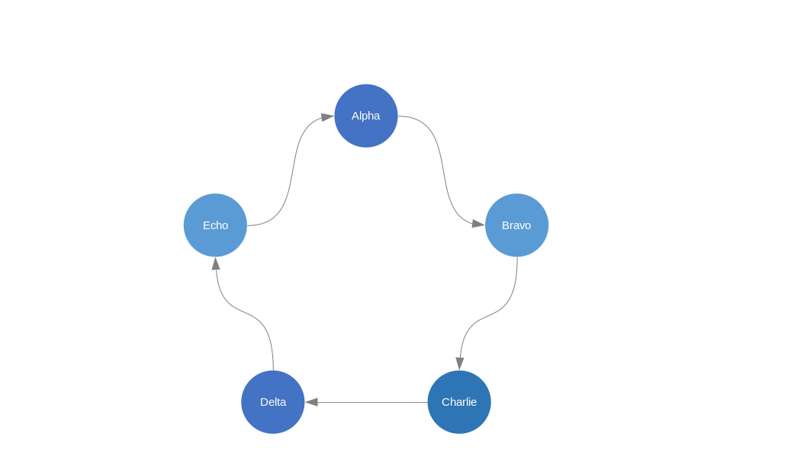
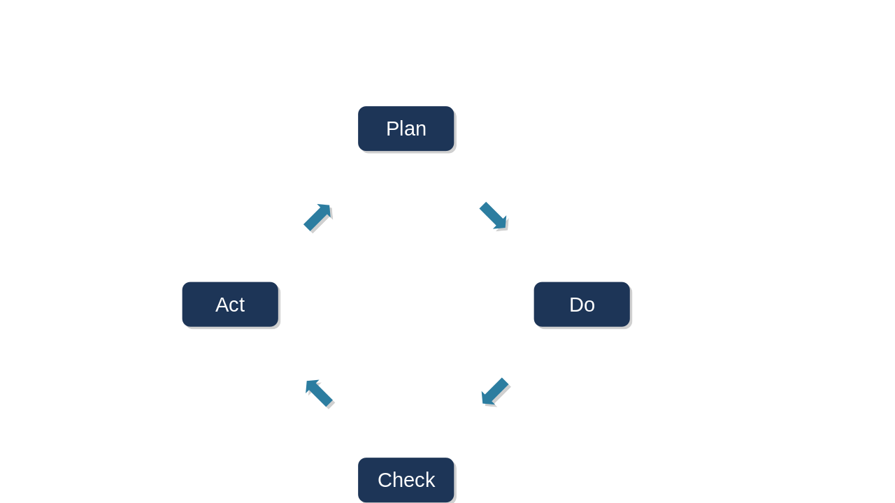
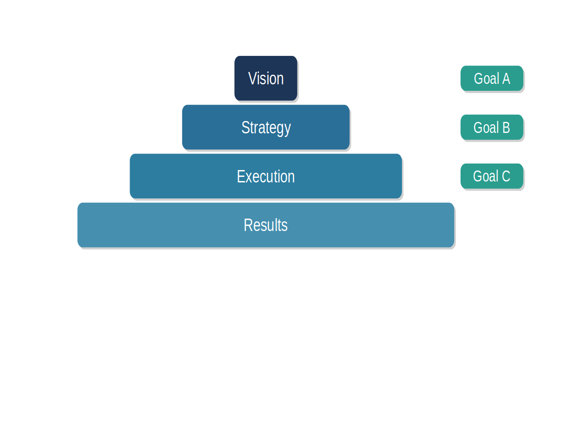
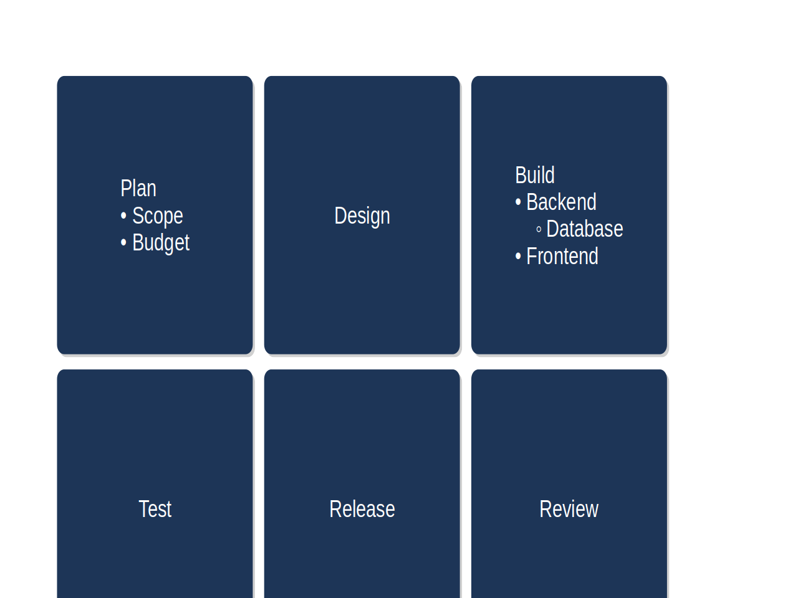
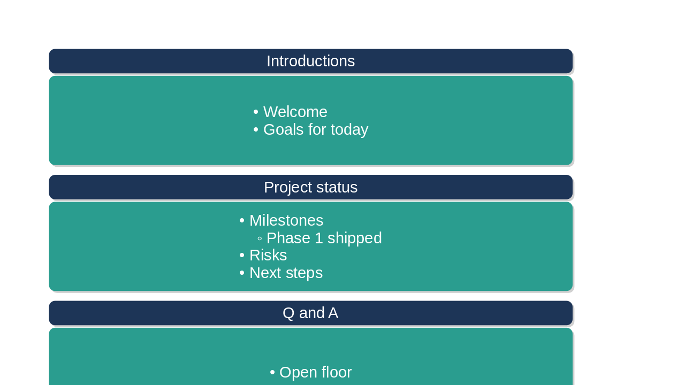
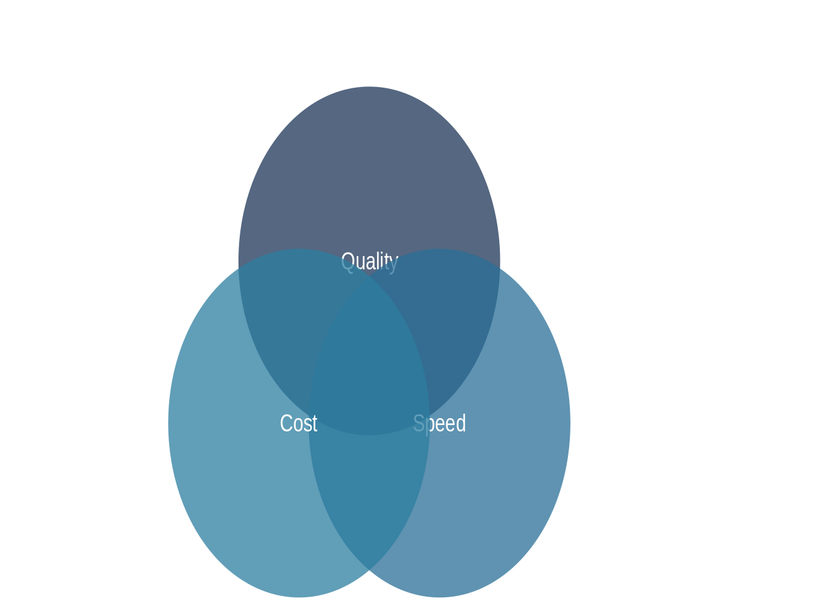

# LibreImpress SmartArt

A LibreOffice Impress UNO extension that generates structured diagrams from
hierarchical text input — hierarchy trees, hub-and-spoke, process flows,
chevron sequences, cycles, pyramids, lists, Venn, matrix, and more.

## Download

**[⬇ SmartArt-0.3.0.oxt](https://github.com/Steedalion/SmartArtForLibreImpress/releases/download/v0.3.0/SmartArt-0.3.0.oxt)**

Double-click the downloaded `.oxt` to install, or use the Extension Manager
(*Tools → Extension Manager → Add*). Restart Impress — a **SmartArt** menu
appears in the menu bar.

Browse all releases → [Releases](https://github.com/Steedalion/SmartArtForLibreImpress/releases)

## Diagram types

| Type | Description | Screenshot |
|------|-------------|------------|
| **Hierarchy** | Top-down tree: one box per node, parents centred over children |  |
| **Hub & Spoke** | Central circle with spoke circles radiating outward; level-3+ children fan in a 90° radial arc |  |
| **Process Flow** | Left-to-right steps joined by arrow connectors; level-2 sub-items in a scaled horizontal row below each step |  |
| **Sequential Chevron** | Pentagon → chevron strip; level-2 sub-items in a scaled horizontal row below each chevron |  |
| **Cycle** | Clockwise ring of rectangles with directed straight-line arrows |  |
| **Cycle (Arrows)** | Clockwise ring of circles with directed curved connector arrows |  |
| **Cycle (Blocks)** | Clockwise ring of rectangles with solid block-arrow shapes between adjacent nodes |  |
| **Pyramid** | Centre-aligned rectangular tiers stacked top-to-bottom, narrowest at apex; level-2+ sub-items to the right |  |
| **Basic Block List** | Equal rectangles in a near-square grid; level-2 and deeper children become nested, indented bullet lines inside each block |  |
| **Vertical Bullet List** | Stacked title bars, each with a content box of its level-2 and deeper children as nested, indented bullets beneath |  |
| **Basic Venn** | Overlapping translucent circles, one per level-1 item, around the slide centre |  |
| **Basic Matrix** | First four level-1 items as the quadrants of a 2×2 grid |  |

## Input format

Enter one item per line. Use leading dashes to express hierarchy depth,
resembling Markdown list syntax:

```
Root
- Child         ← level 2 (one dash + space)
-- Grandchild   ← level 3 (two dashes + space)
- Another Child
```

The **Indent →** and **← Outdent** buttons (or **Ctrl+]** / **Ctrl+[**) add
or remove one dash level on the current line.

The **Style** dropdown picks a visual template — **Modern** (navy→teal,
rounded, soft shadows), **Classic** (Office blues, square corners),
**Minimal** (flat, no shadows) or **Mono** (greyscale). The optional colour
lines override individual levels on top of any template.

## Edit an existing diagram

Every generated diagram stores its source (outline, type, colours) inside the
group shape, and this survives saving and reopening the presentation. To edit:
select the diagram's group on the slide, then run **SmartArt → Create
Diagram…** again — the dialog opens prefilled in *Edit* mode and **Update**
replaces the diagram in place (keeping its position). Changing the type in the
dropdown converts the diagram to another layout.

Notes: manual tweaks made *inside* the group (moved boxes, edited text) are
not read back — Update regenerates from the stored outline. A diagram that
consists of a single shape is not grouped and cannot be edited this way.

## Prerequisites

- **JDK 11+** — `java -version`
- **Maven 3.6+** — `mvn --version`
- **LibreOffice 7.4+** — only needed to install/test the extension.

## Build from source

```bash
mvn clean package
```

Produces **`target/SmartArt.oxt`** (plus a version-stamped copy
**`target/SmartArt-0.3.0.oxt`** for release distribution).

## Install & verify

```bash
PROFILE=file:///tmp/lo-test

# install
unopkg add    --suppress-license -env:UserInstallation=$PROFILE target/SmartArt.oxt

# verify — expect "Identifier: org.libreimpress.smartart"
unopkg list   -env:UserInstallation=$PROFILE

# uninstall
unopkg remove -env:UserInstallation=$PROFILE org.libreimpress.smartart
```

To install into your real LibreOffice profile (close all LibreOffice windows first):

```bash
unopkg add --suppress-license target/SmartArt.oxt
```

## Regenerate screenshots

```bash
bash scripts/make-screenshots.sh
```

## Project structure

```
LibreImpress-SmartArt/
├── pom.xml
├── src/
│   ├── main/java/org/libreimpress/smartart/
│   │   ├── SmartArtCommand.java        # UNO ProtocolHandler + dispatch
│   │   ├── SmartArtDialog.java         # outline-editor dialog
│   │   ├── SmartArtConfig.java         # default seed text
│   │   ├── DemoRunner.java             # [DEV] appends demo slides
│   │   ├── models/                     # DiagramNode, DiagramType, ColorPalette
│   │   ├── parsers/                    # HierarchyParser, PaletteParser
│   │   ├── editing/                    # OutlineEditor (indent/outdent/newline)
│   │   ├── layout/                     # layout algorithms (pure Java, unit-tested)
│   │   │   ├── HierarchyLayout.java
│   │   │   ├── HubAndSpokeLayout.java
│   │   │   ├── ProcessFlowLayout.java
│   │   │   ├── SequentialChevronLayout.java
│   │   │   ├── CycleLayout.java
│   │   │   ├── CycleArrowLayout.java
│   │   │   ├── CycleBlockLayout.java
│   │   │   ├── PyramidLayout.java
│   │   │   ├── BlockListLayout.java
│   │   │   ├── VerticalBulletListLayout.java
│   │   │   ├── VennLayout.java
│   │   │   └── MatrixLayout.java
│   │   ├── rendering/                  # SlideRenderer — draws shapes + connectors
│   │   └── helpers/
│   └── test/java/org/libreimpress/smartart/
│       ├── parsers/HierarchyParserTest.java
│       ├── editing/OutlineEditorTest.java
│       └── layout/                     # 111 unit tests across all layout classes
├── uno-tests/                          # headless LibreOffice integration tests
│   ├── run.sh
│   └── probes/
├── scripts/
│   └── make-screenshots.sh
└── docs/screenshots/
```

## Continuous integration

`.github/workflows/build-and-validate.yml` runs on every push: builds the
`.oxt`, validates its structure, installs LibreOffice, and performs
`unopkg add / list / remove` under `xvfb`.

## Documentation

| Document | Purpose |
|----------|---------|
| [`impressSmartArt.md`](impressSmartArt.md) | Master specification |
| [`Architecture_VDiagram.md`](Architecture_VDiagram.md) | Architecture & V-model |
| [`TESTING_STRATEGY.md`](TESTING_STRATEGY.md) | Testing approach |

---

**Version:** 0.3.0
